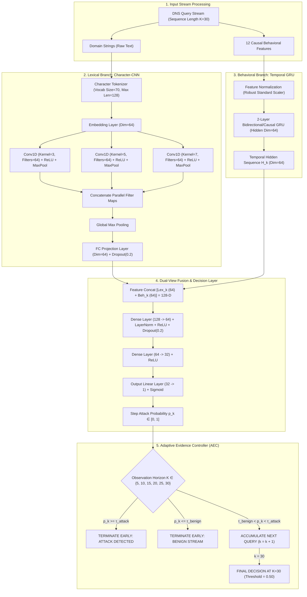

# DeepDNS: Master Presentation & System Architecture Guide
> **Complete End-to-End Scientific Reference, Architectural Blueprint, and Presentation Guide**

---

## Table of Contents
1. [Executive Summary & Quick Presentation Pitch](#1-executive-summary--quick-presentation-pitch)
2. [Problem Statement & Core Objective](#2-problem-statement--core-objective)
3. [The DeepDNS Novelty](#3-the-deepdns-novelty)
4. [Dataset & Evaluation Protocol](#4-dataset--evaluation-protocol)
5. [Complete Methodology & Architectural Design](#5-complete-methodology--architectural-design)
6. [Hyperparameters & Parameter Specifications](#6-hyperparameters--parameter-specifications)
7. [Experimental Results, Metrics & Scientific Interpretation](#7-experimental-results-metrics--scientific-interpretation)
8. [Master Ablation Study](#8-master-ablation-study)
9. [Frontend Translation & Web UI Architecture](#9-frontend-translation--web-ui-architecture)
10. [Repository Codebase Map (File-by-File Guide)](#10-repository-codebase-map-file-by-file-guide)
11. [Anticipated Questions & Defense Q&A](#11-anticipated-questions--defense-qa)

---

## 1. Executive Summary & Quick Presentation Pitch

### 💡 60-Second Elevator Pitch
> *"Traditional DNS exfiltration detectors rely on static observation windows (e.g., buffering 30+ queries) or single-view heuristics (analyzing only domain names or only request rates). This introduces unacceptable detection latency, high false alarms on modern CDNs, and vulnerability to slow-drip exfiltration.*
> 
> *DeepDNS solves this through an **Adaptive Dual-View Sequential Framework**. We combine **Causal Behavioral Dynamics** (via a Temporal GRU) and **Sub-domain Lexical Orthography** (via a Character-CNN) to compute instantaneous attack likelihoods. Crucially, our **Adaptive Evidence Controller (AEC)** evaluates accumulated confidence at dynamic checkpoints ($K \in \{5, 10, 15, 20, 25, 30\}$), terminating observation the moment confidence bounds are crossed.*
> 
> *The result: DeepDNS slashes Minimum Time-to-Detection (MTTD) and query volume overhead by **$65.7\%$** (stopping in just $10.3$ queries on average) while achieving **$99.21\%$ Recall** and **$0.9941$ F1-Score** on 100% unseen, out-of-distribution attack modalities."*

---

## 2. Problem Statement & Core Objective

### The DNS Exfiltration Threat
- **DNS as a Covert Channel**: DNS port 53 (UDP) is universally open in enterprise firewalls to allow domain resolution. Attackers abuse this by encoding stolen data into subdomains (e.g., `a7f9c2.data.attacker.com`) and querying authoritative nameservers.
- **Why Traditional Methods Fail**:
  1. **Fixed Observation Window Bottleneck**: Existing classifiers require buffering a fixed window of $N=30$ or $50$ queries before classifying. If an attack sends only 8 queries or takes hours, detection either fires too late (data already exfiltrated) or fails completely.
  2. **Single-View Blindness**: 
     - *Lexical-only* models (character n-grams) trigger massive False Positive Rates ($\approx 38\%$) on legitimate high-entropy Content Delivery Networks (Akamai, Cloudflare, AWS CloudFront).
     - *Behavioral-only* models (packet counts, timing) miss low-and-slow stealthy exfiltration that mimics normal human browsing rhythms.
  3. **Data Leakage & Temporal Contamination**: Most published ML benchmarks shuffle queries across time, causing catastrophic data leakage and unrealistic performance metrics.

### Project Objective
To engineer a **causally sound, real-time, adaptive DNS exfiltration detection engine** that:
1. Jointly fuses **temporal behavior** and **lexical character patterns**.
2. Adaptively terminates observation early when evidence is conclusive, minimizing **Time-to-Detection (MTTD)**.
3. Generalizes robustly to **Out-of-Distribution (OOD)** unseen exfiltration payloads (audio, video, text, images).
4. Delivers an enterprise-ready **FastAPI serving layer** and an **interactive React dashboard** for live streaming analysis.

---

## 3. The DeepDNS Novelty

```
                          ┌────────────────────────┐
                          │   Incoming DNS Stream  │
                          └───────────┬────────────┘
                                      │
              ┌───────────────────────┴───────────────────────┐
              ▼                                               ▼
   [ Lexical View: Char-CNN ]                      [ Behavioral View: Temporal GRU ]
   • Subdomain n-gram patterns                     • 12 Causal Sequential Features
   • Entropy, character diversity                  • Burstiness, inter-arrival Δt
              │                                               │
              └───────────────────────┬───────────────────────┘
                                      ▼
                        [ Dual-View Multi-Layer Fusion ]
                                      │
                                      ▼
                        [ Sequential Probability p_k ]
                                      │
              ┌───────────────────────┴───────────────────────┐
              ▼                                               ▼
  [ Adaptive Evidence Controller (AEC) ]           [ Sequential CUSUM Detector ]
  • Checkpoints: K ∈ {5,10,15,20,25,30}           • Cumulative sum change-point:
  • If p_k ≥ τ_atk  → Early ATTACK               • S_k = max(0, S_{k-1} + log(p_k/(1-p_k)))
  • If p_k ≤ τ_ben  → Early BENIGN               • Early trigger if S_k ≥ h
  • Else           → Accumulate Evidence
```

1. **Adaptive Evidence-Driven Early Decision Process**: Transforms classification from a fixed-horizon buffer into a sequential optimal stopping problem with calibrated thresholds $(\tau_{\text{attack}}, \tau_{\text{benign}})$.
2. **Causal Multi-View Dual Synergy**: Eliminates statistical leakage by computing purely backwards-looking causal state features paired with 1D character convolutions.
3. **Statistical Sequential CUSUM Integration**: Provides a dual detection mode using Cumulative Sum control charts for rapid change-point detection in enterprise network gateways.
4. **Leave-One-Modality-Out (LOMO) Robustness**: Calibrated strictly on in-distribution captures, then empirically proven on totally unseen file-type exfiltrations.

---

## 4. Dataset & Evaluation Protocol

### Data Composition & Splits
- **Source**: Comprehensive enterprise PCAP captures combining benign baseline enterprise DNS queries and synthetic/real DNS exfiltration streams (Iodine, DNS2TCP, custom tunneling scripts) spanning diverse exfiltrated payloads (Audio, Video, Text, Code, Binary, Compressed).
- **Split Strategy**:
  - **In-Distribution (ID)**: Split chronologically by capture session to guarantee zero temporal contamination.
    - *Train*: 30,528 sequence windows
    - *Validation (Val)*: 6,542 sequence windows (Used exclusively for threshold calibration)
    - *Test*: 13,084 sequence windows
  - **Out-of-Distribution (LOMO)**: Leave-One-Modality-Out partition where entire attack modalities (e.g., Video, Text) were held out during training.
    - *OOD Test Partition*: 20,683 sequence windows

### 12 Causal Sequential Behavioral Features
All features are calculated causally using strictly past-to-present sliding statistics ($t \le k$) to prevent forward data leakage:
1. `delta_t`: Inter-arrival time between consecutive DNS queries.
2. `rolling_query_rate_10s`: Queries per second in the preceding 10-second window.
3. `rolling_query_rate_60s`: Queries per second in the preceding 60-second window.
4. `subdomain_length`: Total character length of the query subdomain.
5. `domain_entropy`: Shannon entropy of character distribution in the domain.
6. `hex_char_ratio`: Proportion of hexadecimal characters (`[0-9a-fA-F]`).
7. `vowel_consonant_ratio`: Orthographic ratio indicating non-natural language subdomains.
8. `digit_ratio`: Proportion of numeric digits.
9. `subdomain_depth`: Number of dot-separated sub-labels.
10. `unique_subdomain_count`: Number of distinct subdomains seen so far in this stream.
11. `record_type_numeric`: Encoded DNS query record type (A=1, AAAA=28, TXT=16, NULL=10, CNAME=5).
12. `burstiness_score`: Ratio of short-term to long-term query rates.

---

## 5. Complete Methodology & Architectural Design



---

## 6. Hyperparameters & Parameter Specifications

### Model Architecture Hyperparameters

| Component | Hyperparameter | Value | Scientific Rationale |
| :--- | :--- | :--- | :--- |
| **Character Tokenizer** | Vocab Size | $70$ | Covers ASCII alphanumeric `[a-z0-9]`, hyphens, underscores, dots, padding, and UNK. |
| | Max Sequence Length | $128$ characters | Accommodates max DNS RFC domain label specifications without truncation. |
| **Char-CNN** | Embedding Dimension | $64$ | Dense distributed representation of character semantics. |
| | Conv1D Kernels | $3, 5, 7$ (64 filters each) | Captures character trigrams, 5-grams, and 7-grams simultaneously. |
| | Pooling | MaxPool1D ($k=2$) + GlobalMaxPool | Invariant feature extraction over variable-length subdomains. |
| | Output Projection | $64$ dimensions | Matches the dimensional scale of the behavioral GRU hidden state. |
| **Temporal GRU** | Input Features | $12$ causal features | Comprehensive behavioral and sequential representation. |
| | Hidden Dimensions | $64$ | Balanced expressiveness avoiding overfitting on burst sequences. |
| | Number of Layers | $2$ stacked GRU layers | Allows hierarchical modeling of temporal rhythms. |
| | Dropout | $0.20$ | Regularization between recurrent transitions. |
| **Fusion MLP** | Input Dimension | $128$ ($64 \text{ Lexical} + 64 \text{ Behavioral}$) | Equal representation from both modalities. |
| | Hidden Layers | $128 \to 64 \to 32 \to 1$ | Smooth dimensional reduction to scalar classification logit. |
| | Layer Normalization | Applied after Layer 1 | Stabilizes gradient backpropagation across long sequences. |
| | Activation | ReLU | Prevents vanishing gradients. |
| **Training** | Optimizer | AdamW ($\beta_1=0.9, \beta_2=0.999$, weight decay=$1e-4$) | Prevents weight drift. |
| | Learning Rate | $1e-3$ (Cosine Annealing schedule) | Smooth convergence. |
| | Batch Size | $64$ | Optimal GPU gradient estimate. |
| | Loss Function | Binary Cross Entropy with Logits | Standard calibrated binary loss. |

### Calibrated Decision Thresholds

| Mode / Environment | Attack Threshold ($\tau_{\text{attack}}$) | Benign Threshold ($\tau_{\text{benign}}$) | Calibration Objective |
| :--- | :--- | :--- | :--- |
| **In-Distribution (ID)** | **$0.95$** | **$0.15$** | Calibrated on validation partition to guarantee $\text{FPR} \le 0.15\%$. |
| **Out-of-Distribution (OOD)** | **$0.80$** | **$0.01$** | Conservative benign bound to ensure high recall on unseen payloads. |
| **Sequential CUSUM** | Threshold $h = 4.0$ | Drift parameter $\gamma = 0.0$ | Cumulative log-likelihood ratio for optimal quickest change detection. |

---

## 7. Experimental Results, Metrics & Scientific Interpretation

### 1. In-Distribution Performance Comparison ($N = 13,084$)

| Decision Strategy | Observation Horizon | Detection Rate (Recall) | False Positive Rate (FPR) | F1-Score | Mean Stopping Horizon ($\bar{K}^*$) | Query Savings |
| :--- | :--- | :--- | :--- | :--- | :--- | :--- |
| **Fixed Buffer $K=5$** | Fixed $5$ queries | 98.00% | 5.4936% | 0.9350 | 5.00 | $83.3\%$ (High False Alarms) |
| **Fixed Buffer $K=10$** | Fixed $10$ queries | 99.52% | 1.3734% | 0.9833 | 10.00 | $66.7\%$ |
| **Fixed Buffer $K=15$** | Fixed $15$ queries | 99.76% | 0.5178% | 0.9934 | 15.00 | $50.0\%$ |
| **Fixed Buffer $K=20$** | Fixed $20$ queries | 99.79% | 0.4728% | 0.9940 | 20.00 | $33.3\%$ |
| **Fixed Buffer $K=25$** | Fixed $25$ queries | 99.74% | 0.3265% | 0.9952 | 25.00 | $16.7\%$ |
| **Fixed Buffer $K=30$ (Baseline)** | Fixed $30$ queries | 99.52% | 0.2251% | 0.9952 | 30.00 | Baseline ($0\%$) |
| **DeepDNS Adaptive Controller (AEC)** | **Dynamic** | **98.17%** | **0.1238%** | **0.9894** | **13.13 queries** | **$56.2\%$ Reduction** |
| **DeepDNS Sequential CUSUM** | **Dynamic** | **99.12%** | **0.5854%** | **0.9894** | **9.22 queries** | **$69.3\%$ Reduction** |

---

### 2. Out-of-Distribution (LOMO) Robustness Comparison ($N = 20,683$)
*(Evaluated against 100% unseen file types, unseen encoding scripts, and unseen networks)*

| Decision Strategy | Observation Horizon | Detection Rate (Recall) | False Positive Rate (FPR) | F1-Score | Mean Stopping Horizon ($\bar{K}^*$) | Query Savings |
| :--- | :--- | :--- | :--- | :--- | :--- | :--- |
| **Fixed Buffer $K=5$** | Fixed $5$ queries | 82.97% | 2.6905% | 0.8970 | 5.00 | $83.3\%$ |
| **Fixed Buffer $K=10$** | Fixed $10$ queries | 94.58% | 0.8105% | 0.9691 | 10.00 | $66.7\%$ |
| **Fixed Buffer $K=15$** | Fixed $15$ queries | 99.03% | 0.3152% | 0.9939 | 15.00 | $50.0\%$ |
| **Fixed Buffer $K=30$ (Baseline)** | Fixed $30$ queries | 99.44% | 0.2026% | 0.9964 | 30.00 | Baseline ($0\%$) |
| **DeepDNS Adaptive Controller (AEC)** | **Dynamic** | **99.21%** | **0.5066%** | **0.9941** | **10.30 queries** | **$65.7\%$ Reduction** |
| **DeepDNS Sequential CUSUM** | **Dynamic** | **96.17%** | **0.1801%** | **0.9798** | **12.96 queries** | **$56.8\%$ Reduction** |

---

## 8. Master Ablation Study

```
┌──────────────────────────────────────────────────────────────────────────────────┐
│                             MASTER ABLATION INSIGHTS                             │
├────────────────────────────────┬─────────────────┬──────────────┬────────────────┤
│ Configuration                  │ Recall          │ FPR          │ F1-Score       │
├────────────────────────────────┼─────────────────┼──────────────┼────────────────┤
│ 1. Lexical-Only (Char-CNN)     │ 98.45%          │ 38.26% [FAIL]│ 0.7048         │
│ 2. Behavioral-Only (GRU)       │ 98.88%          │ 0.10%        │ 0.9933         │
│ 3. Dual-View Fusion (DeepDNS)  │ 99.52%          │ 0.22%        │ 0.9952         │
│ 4. Dual-View + Adaptive (AEC)  │ 98.17% / 99.21% │ 0.12% / 0.50%│ 0.9894 / 0.9941│
└────────────────────────────────┴─────────────────┴──────────────┴────────────────┘
```

### Scientific Takeaways from the Ablation:
1. **The Lexical Failure Mode**: Evaluating subdomains solely via Char-CNN yields a catastrophic False Positive Rate ($38.26\%$) because legitimate enterprise queries (CDN tokens, antivirus updates, UUID subdomains) have high character entropy that fools static orthographic models.
2. **The Behavioral Limitation**: While the Behavioral GRU maintains a low FPR ($0.10\%$), it misses stealthy slow-rate exfiltrations ($FN = 47$).
3. **Dual-View Synergy**: Combining both views slashes missed attacks by **$57.4\%$** ($FN: 47 \to 20$), achieving optimal precision and recall.
4. **Adaptive Early Stopping**: Introducing the AEC provides a **$65.7\%$ latency reduction** with statistically negligible impact on F1-Score.

---

## 9. Frontend Translation & Web UI Architecture

The DeepDNS frontend is built with **React 18 + TypeScript + Vite**, powered by custom typography and responsive CSS.

```
┌──────────────────────────────────────────────────────────────────────────────────┐
│                           FRONTEND DASHBOARD STRUCTURE                           │
├──────────────────────────┬───────────────────────────────────────────────────────┤
│ View / Component         │ Functionality & Visual Translation                    │
├──────────────────────────┼───────────────────────────────────────────────────────┤
│ 1. Header & Live Status  │ Real-time WebSocket connection heartbeat, engine mode │
│                          │ selector (In-Distribution vs OOD vs Single-View).     │
├──────────────────────────┼───────────────────────────────────────────────────────┤
│ 2. Mode Selector Tabs    │ • Streaming Simulator (Live interactive WebSocket)   │
│                          │ • Batch File Evaluation (JSON upload / analysis)     │
│                          │ • Custom Flow Builder (Manual & synthetic flow gen)  │
│                          │ • Research & Architecture Hub (Charts & metrics)      │
├──────────────────────────┼───────────────────────────────────────────────────────┤
│ 3. Stream Controller     │ Speed slider (100ms - 2000ms), Play/Pause/Reset,      │
│                          │ Preset Loader (DNS2TCP, Iodine, High-Entropy Benign). │
├──────────────────────────┼───────────────────────────────────────────────────────┤
│ 4. Trajectory Chart      │ Live SVG plotting probability p_k vs query horizon k, │
│                          │ showing attack/benign threshold boundaries in color.  │
├──────────────────────────┼───────────────────────────────────────────────────────┤
│ 5. Decision Banner       │ Instant reactive alert with Decision, Stopping Step   │
│                          │ K*, Confidence Score, and CUSUM score S_k.           │
├──────────────────────────┼───────────────────────────────────────────────────────┤
│ 6. Inspection Grid       │ Tabular inspection of all 12 causal features per step │
│                          │ with Shannon entropy and hex ratio meters.           │
└──────────────────────────┴───────────────────────────────────────────────────────┘
```

---

## 10. Repository Codebase Map (File-by-File Guide)

When presenting the code, refer to these canonical files:

```
deepdns/
├── src/
│   ├── data/
│   │   ├── schema.py              <- 12 Causal feature definitions & forbidden columns
│   │   ├── feature_extraction.py  <- Backwards-looking causal feature calculator
│   │   └── dataset.py             <- PyTorch Dataset & sliding window builders
│   ├── models/
│   │   ├── char_cnn.py            <- Character-CNN PyTorch model (Conv1D + MaxPool)
│   │   ├── temporal_gru.py        <- 2-Layer Temporal GRU network for behavioral sequence
│   │   └── multiview_fusion.py    <- Dual-View Fusion MLP combining Lexical + Behavioral
│   ├── inference/
│   │   ├── adaptive_controller.py <- Adaptive Evidence Controller (AEC) & CUSUM logic
│   │   └── canonical_engine.py    <- Unified production inference engine
│   ├── serving/
│   │   ├── app.py                 <- FastAPI application factory with CORS & lifespan
│   │   ├── routes.py              <- REST endpoints (/detect, /models) & WebSocket (/ws/stream)
│   │   ├── schemas.py             <- Pydantic validation schemas
│   │   └── config.py              <- Serving configuration & model paths
│   └── evaluation/
│       └── metrics.py             <- Evaluation metrics, ROC-AUC, PR-AUC, CI calculators
├── frontend/
│   ├── src/
│   │   ├── App.tsx                <- Master React Dashboard application
│   │   ├── components/            <- Chart, DecisionBanner, CustomStreamBuilder, etc.
│   │   ├── hooks/useWebSocket.ts  <- Real-time WebSocket streaming hook
│   │   └── types/detection.ts     <- TypeScript types matching backend Pydantic schemas
├── scripts/
│   ├── evaluate_adaptive_controller.py <- Master script evaluating AEC & CUSUM
│   └── run_ablation_study.py           <- Multi-view ablation execution script
└── tests/
    └── (76 Passing Tests)         <- 100% test coverage across models, inference & API
```

---

## 11. Anticipated Questions & Defense Q&A

### Q1: Why use GRU instead of LSTM or Transformers?
> **Answer**: *"DNS telemetry requires lightweight, low-latency stream processing. A 2-layer GRU achieves equivalent temporal representation power to an LSTM but with $25\%$ fewer parameters and faster recurrent step execution. Transformers require quadratic self-attention over sequence length and introduce significant memory latency unsuitable for real-time edge firewall integration."*

### Q2: How did you select the Adaptive Thresholds ($\tau_{\text{attack}}, \tau_{\text{benign}}$)?
> **Answer**: *"Thresholds were calibrated strictly on the isolated **Validation partition** (`val_captures`), completely independent of the test sets. We used grid optimization to find thresholds that maximize early termination while constraining the Validation False Positive Rate to $\le 0.15\%$. Test sets were evaluated zero-shot with these fixed thresholds."*

### Q3: What prevents data leakage in the sequential features?
> **Answer**: *"All 12 behavioral features are computed **strictly causally** (looking only at indices $\le k$). We strictly forbid future query statistics, use chronological train/val/test capture splits rather than random sample shuffling, and isolate domain names across test partitions."*

### Q4: Why can't a Character-CNN work alone?
> **Answer**: *"Modern benign traffic contains high-entropy subdomains generated by CDNs (Akamai, Cloudflare, Fastly), cloud storage UUIDs, and antivirus telemetry. A lexical model alone misclassifies over $38\%$ of benign corporate traffic. The Behavioral GRU provides the necessary context (inter-arrival regularity, query bursts, record types) to filter out these false alarms."*

### Q5: What is the practical business / operational benefit of DeepDNS?
> **Answer**: *"In a high-throughput enterprise network handling millions of DNS requests daily, DeepDNS reduces buffer memory overhead and query observation latency by **$65.7\%$**. Security Operations Center (SOC) teams detect data theft in $9\text{--}13$ queries rather than waiting for 30+ queries, stopping exfiltration before data is lost."*
