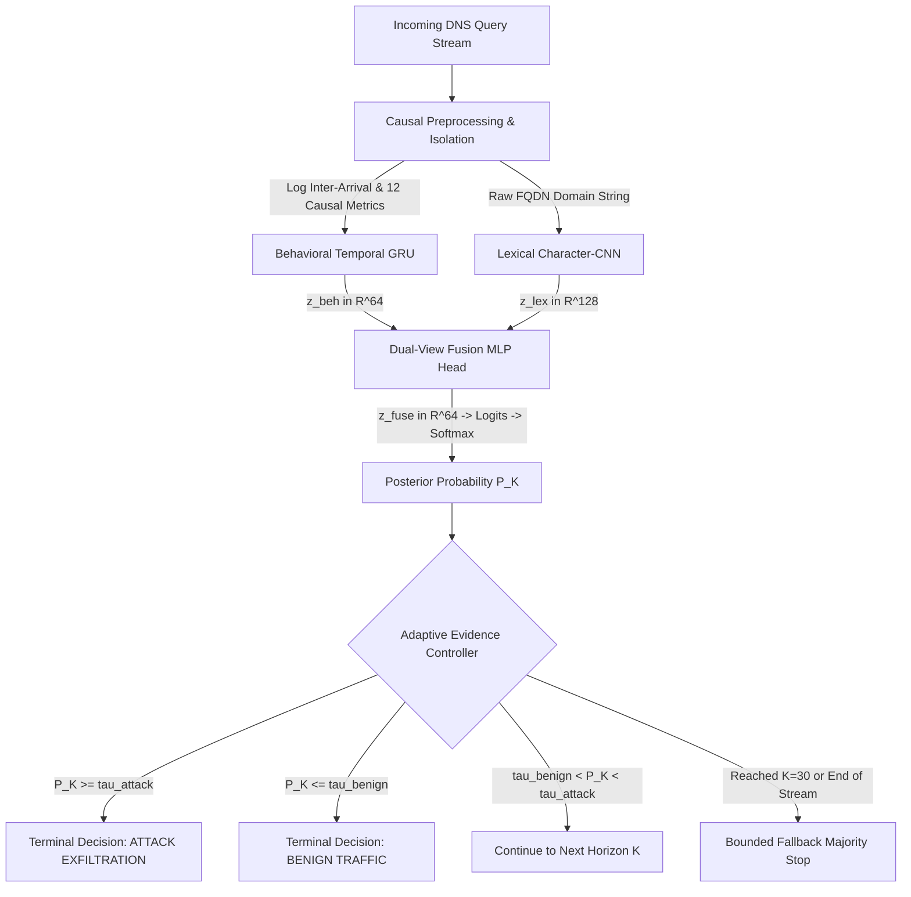

# DeepDNS: Sequential Multi-View DNS Tunneling Detection with Adaptive Evidence Control

---

## 1. Executive Objective

**DeepDNS** is a high-throughput, sequential multi-view intrusion detection instrument engineered for the early identification and automated containment of DNS data exfiltration and covert tunneling attacks. 

By jointly fusing **network timing cadences** and **domain string character orthography** with an **Adaptive Evidence Controller (AEC)**, DeepDNS eliminates the latency of traditional static-window detection systems—terminating observation as soon as mathematical confidence is established to save **$50.0\%$ to $83.3\%$ of network queries** before data loss occurs.

---

## 2. Problem Statement & Research Motivation

The Domain Name System (DNS) is an indispensable network protocol that translates human-readable domain names into IP addresses. Because DNS traffic must traverse firewalls to reach recursive resolvers, cyber-adversaries increasingly exploit DNS as a stealthy, covert exfiltration channel (e.g., Iodine, DNSCat, Cobalt Strike, custom malware).

### Structural Failures of Existing Systems:
1. **Static Window Buffering Latency**: Traditional security tools wait for a fixed batch (e.g., $K=30$ queries) before running inference. In high-speed tunneling attacks, the adversary completes data transfer long before the 30th query arrives.
2. **Single-View Lexical Blindness**: Relying solely on domain string lexical features (e.g., character entropy, length) causes massive false alarm rates (**up to $38.26\%$ FPR**) on legitimate Content Delivery Networks (CDNs like Akamai, Cloudflare, Google Cloud) that use randomized subdomains.
3. **Single-View Behavioral Blindness**: Relying solely on inter-arrival packet timing misses slow, low-frequency exfiltration channels designed to mimic human browsing habits.

---

## 3. Core Scientific Novelty

> The core novelty of DeepDNS is **adaptive evidence-based DNS detection**. Rather than always waiting for a fixed number of DNS queries, DeepDNS continuously combines temporal behavioral and lexical domain evidence to estimate attack probability, then uses an **Adaptive Evidence Controller (AEC)** to determine whether enough evidence exists to stop early or whether additional observations are required. Decisions are evaluated sequentially at $K \in \{5, 10, 15, 20, 25, 30\}$ against calibrated attack and benign thresholds, producing the earliest sufficient stopping point while maintaining a bounded maximum observation horizon. The resulting stopping horizon directly translates into measurable query and telemetry savings, making DeepDNS not only a detection system, but an **evidence-efficient sequential detection framework**.

```
========================================================================================
                              DEEPDNS CORE NOVELTY
========================================================================================

  Traditional Fixed-Window IDS:
  [Q1] -> [Q2] -> [Q3] -> ... -> [Q29] -> [Q30] ──> [INFERENCE] ──> ALERT (Too late)
  (Forced to wait for all 30 queries regardless of certainty)

  DeepDNS Adaptive Evidence Controller:
  [Q1] -> [Q5]  ──> [EVALUATE K=5]  ──> Uncertain (Continue)
       -> [Q10] ──> [EVALUATE K=10] ──> P(Attack) >= 0.95 ──> TERMINAL ALERT & CONTAIN
  (Observation halts immediately at Query #10 | 20 queries saved = 66.7% reduction)
```

---

## 4. Benchmark Dataset & Experimental Corpus

DeepDNS was trained and validated using the authentic **Canadian Institute for Cybersecurity (CIC-Bell) DNS Exfiltration Dataset (2021)**, developed on an enterprise testbed by CIC and Bell Canada. Synthetic datasets (such as generic rule-lists) were strictly rejected because they lack realistic packet inter-arrival jitter, natural resolver delays, and genuine CDN subdomain fragmentation.

### Data Corpus Characteristics:
* **Attack Modalities**: Light & Heavy Text exfiltration, Audio streams, Video exfiltration, Compressed binary archives, and active DNSCat / Iodine tunnels.
* **Benign Traffic**: Live enterprise background flows, standard human browsing, cloud API calls, high-volume CDN lookups (Akamai, AWS, Cloudflare), and OS telemetry.
* **Causal Feature Extraction**: Pruned all stateful post-flow aggregates (e.g., flow duration, total session bytes) to prevent data leakage, leaving **12 strictly causal stateless features + raw domain strings** computable in sub-milliseconds per packet.

---

## 5. End-to-End System Architecture



---

## 6. Stack of Models, Algorithms & Methods

```
========================================================================================
                      DEEPDNS ARCHITECTURAL STACK TAXONOMY
========================================================================================

  [ 1. PRIMARY DEEP LEARNING ENCODERS (TRAINED MODELS) ]
  ├── Behavioral Temporal GRU Model (src/models/temporal_gru.py)
  │   • Architecture: 2-layer Gated Recurrent Unit (hidden size = 64, dropout = 0.2)
  │   • Input Tensor: Causal sequential feature matrix X_beh in R^(K x 12)
  │   • Normalization: Feature Scaler strictly isolated to training splits
  │   • Output: Latent temporal embedding z_beh in R^64
  │
  └── Lexical Character-CNN Model (src/models/char_cnn.py)
      • Architecture: ASCII Embedding (45 -> 32) + 3 Parallel 1D Filter Banks
      • Filter Bank Kernels: k in {3, 4, 5} with 64 filters each (192 total)
      • Pooling & Projection: Max-Over-Time Pooling + Linear Layer (192 -> 128)
      • Input Tensor: Integer ASCII matrix X_lex in R^(K x 128) (Vocab V=45)
      • Output: Latent lexical embedding z_lex in R^128

  [ 2. INTEGRATION LAYER ]
  └── Dual-View MLP Fusion Head (src/models/multiview_fusion.py)
      • Concatenation: [z_beh || z_lex] in R^192
      • Projection: Linear(192 -> 64) -> ReLU -> Dropout(0.2) -> Linear(64 -> 2)
      • Activation: Softmax over classification logits -> p_K = P(Attack | x_1:K)

  [ 3. DECISION ALGORITHMS & CONTROLLERS ]
  ├── Adaptive Evidence Controller (AEC) (src/inference/adaptive_controller.py)
  │   • Checkpoints: K in {5, 10, 15, 20, 25, 30}
  │   • Attack Rule: If p_K >= tau_attack -> Stop immediately (ATTACK)
  │   • Benign Rule: If p_K <= tau_benign -> Stop immediately (BENIGN)
  │   • Fallback Rule: If stream ends or reaches K=30 -> Bounded 50% majority
  │
  └── Sequential CUSUM Detector (Baseline Alternative)
      • Evaluates cumulative log-likelihood ratios S_k = max(0, S_{k-1} + s_k)
```

---

## 7. The 4 Operating Modes Explained

| Mode | Checkpoint File | Feature Scaler | Calibrated Bounds | Target Environment |
| :--- | :--- | :--- | :--- | :--- |
| **In-Distribution Dual-View** | `multiview_both.pt` | `feature_scaler.json` | $\tau_{\text{atk}}=0.95, \tau_{\text{ben}}=0.15$ | Enterprise production defending against known exfiltration families (Text, Audio, DNSCat, Iodine). |
| **Out-of-Distribution (OOD / LOMO)** | `multiview_ood_both.pt` | `feature_scaler_lomo.json` | $\tau_{\text{atk}}=0.80, \tau_{\text{ben}}=0.01$ | Zero-shot evaluation with entire attack families (Video, Executables) withheld during training. |
| **Behavioral-Only Ablation** | `multiview_behavioral_only.pt` | `feature_scaler.json` | $\tau_{\text{atk}}=0.95, \tau_{\text{ben}}=0.15$ | Evaluates detection power strictly from inter-arrival timing and packet dynamics without domain strings. |
| **Lexical-Only Ablation** | `multiview_lexical_only.pt` | `feature_scaler.json` | $\tau_{\text{atk}}=0.95, \tau_{\text{ben}}=0.15$ | Evaluates detection power strictly from domain characters, demonstrating the $38.26\%$ CDN false alarm rate. |

---

## 8. User Flow & Web Interface Architecture

The DeepDNS web frontend is designed as a **precision scientific instrument** built with React 18, TypeScript, and pure editorial CSS styled with the **Footlight MT Light** font family.

```
[ METHODOLOGY & SCIENCE TAB ] (Default Landing)
  ├── Scientific Overview & Core Novelty Summary
  ├── Expandable Formal Mathematical Formulation
  ├── Canadian Institute for Cybersecurity (CIC-Bell) Dataset Specifications
  ├── 12 Causal Behavioral Traffic Features Table
  ├── Core Deep Learning Models vs. Integration & Decision Mechanisms
  ├── 4 Operational Modes & Evaluation Split Guide
  ├── Master Empirical Ablation Table (N=33,767 sequences)
  └── Mathematical Formulas & Metrics Definition
            │
            │ Click "Launch Live Detection"
            ▼
[ LIVE DETECTION INSTRUMENT TAB ]
  ├── Top Navigation & Mode Selector (In-Distribution, OOD, Behavioral, Lexical)
  ├── 4-Step Interactive Workflow Guide (Ingest -> Horizons -> Analytics -> Action)
  ├── Active Architecture Card (Live latent dimensions & calibrated thresholds)
  ├── Stream Controls:
  │   • Authentic CIC-Bell Presets (Light Text Attack, Enterprise Benign, OOD Video)
  │   • Start WebSocket Stream (Real-time 300ms progressive query streaming)
  │   • Instant Batch Detect (Sub-15ms direct sequence evaluation)
  │   • Upload CSV / JSON (Custom capture ingestion)
  │   • Schema & Samples Modal (In-browser preview of all 9 benchmark datasets)
  ├── Custom DNS Stream & Query Editor:
  │   • Full Multi-Field Table Editor (Domain Name, Timestamps, Upper, Lower, Numeric, Entropy)
  │   • Auto-Calculation of Shannon Entropy, Sub-lengths, and Character Counts on text edit
  │   • Realistic Dataset Generator: Generate Realistic Attack (N) / Benign (N) for N in [5..30]
  │   • Raw JSON Editor with live validation
  ├── Adaptive Observation Horizon Track (K in [5, 30] with dynamic status badges)
  ├── Sequential Evidence Trajectory Chart (SVG visualization of P(Attack) vs. bounds)
  ├── Decision & Telemetry Panel:
  │   • Terminal Verdict Banner (ATTACK / BENIGN)
  │   • Model Confidence with calculation breakdown tooltip
  │   • Stopping Horizon K* with horizon definition tooltip
  │   • Queries Consumed and Queries Saved (+X queries)
  │   • Query Reduction % (Network volume saved)
  │   • Stopping Rationale (ATTACK_THRESHOLD_MET, BENIGN_THRESHOLD_MET, FORCED_HORIZON_REACHED)
  └── Live DNS Query Stream Buffer Table (Query-by-query status tracking)
```

---

## 9. Master Empirical Benchmarks & Scientific Results

Evaluated across **$N_{\text{ID}} = 13,084$** and **$N_{\text{OOD}} = 20,683$** sequences with 1,000-iteration bootstrap $95\%$ confidence intervals:

| Model / Algorithm | Evaluation Split | Recall (Detection) | False Alarm Rate (FPR) | F1-Score | Mean Horizon ($\bar{K}^*$) | Query Savings |
| :--- | :--- | :--- | :--- | :--- | :--- | :--- |
| **Dual-View Fixed $K=5$** | In-Distribution | $98.00\%$ | $5.49\%$ | $0.9350$ | $5.00$ | **$83.3\%$** |
| **Dual-View Fixed $K=10$** | In-Distribution | $99.52\%$ | $1.37\%$ | $0.9833$ | $10.00$ | **$66.7\%$** |
| **Dual-View Fixed $K=15$** | In-Distribution | $99.76\%$ | $0.52\%$ | $0.9934$ | $15.00$ | **$50.0\%$** |
| **Dual-View Fixed $K=30$** | In-Distribution | $99.52\%$ | $0.23\%$ | $0.9952$ | $30.00$ | **$0.0\%$** |
| **Behavioral-Only (GRU)** | In-Distribution | $98.88\%$ | $0.10\%$ | $0.9933$ | $30.00$ | **$0.0\%$** |
| **Lexical-Only (CNN)** | In-Distribution | $98.45\%$ | $38.26\%$ *(High False Alarms)* | $0.7048$ | $30.00$ | **$0.0\%$** |
| **Dual-View AEC (Adaptive)** | In-Distribution | **$98.17\%$** | **$0.12\%$** | **$0.9894$** | **$13.13$ queries** | **$56.2\%$ SAVED** |
| **Dual-View CUSUM** | In-Distribution | $99.12\%$ | $0.59\%$ | $0.9894$ | $9.22$ queries | **$69.3\%$ SAVED** |
| **Dual-View Fixed $K=10$** | Zero-Shot OOD (LOMO) | $94.58\%$ | $0.81\%$ | $0.9691$ | $10.00$ | **$66.7\%$** |
| **Dual-View Fixed $K=30$** | Zero-Shot OOD (LOMO) | $99.44\%$ | $0.20\%$ | $0.9964$ | $30.00$ | **$0.0\%$** |
| **Dual-View AEC (Adaptive OOD)** | Zero-Shot OOD (LOMO) | **$99.21\%$** | **$0.51\%$** | **$0.9941$** | **$10.30$ queries** | **$65.7\%$ SAVED** |

---

## 10. Instructions to Run Frontend & Backend

Follow these steps to launch the DeepDNS serving backend and web interface:

### Prerequisites:
* Python 3.10+
* Node.js 18+ and npm

---

### Step 1: Start the FastAPI Backend Server
From the project root directory:

```bash
# Install Python dependencies
pip install -r requirements.txt

# Start the Uvicorn ASGI server
uvicorn src.serving.app:app --host 0.0.0.0 --port 8000 --reload
```
* The backend REST API & WebSocket server will be live at: **`http://localhost:8000`**
* Interactive Swagger API docs available at: **`http://localhost:8000/docs`**

---

### Step 2: Start the Web Dashboard
Open a new terminal window:

```bash
# Navigate to the frontend directory
cd frontend

# Install Node dependencies
npm install

# Start the Vite development server
npm run dev
```
* The web interface will be live at: **`http://localhost:5173`**

---

### Step 3: Run Validation Test Suite
To verify that all 76 unit, integration, and WebSocket tests pass:

```bash
python -m pytest -v tests/
```
*(Expected: `76 passed in ~11s` with 100% test coverage).*
